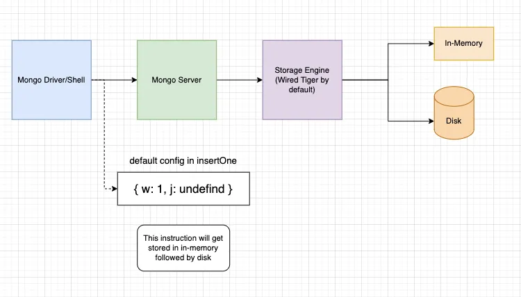

# writeConcern



- MongoDB에서 `insertOne`이나 `insertMany`로 쓰기 작업이 일어날 때, 데이터는 먼저 메모리에 저장됨. 빠른 처리를 위해 메모리에 저장하고, 스토리지 엔진(WiredTiger)이 이를 처리함.
- WiredTiger는 데이터를 저널 파일에 기록함. 저널은 데이터 안정성과 복구를 위해 사용됨. 시스템 오류나 장애가 발생해도 저널에 기록된 데이터를 복구할 수 있음.
- 저널링을 통해 데이터가 디스크에 기록되기 전에 안정성을 확보함. 저널에 기록된 후, 데이터는 디스크에 영구 저장됨. 이 단계에서 Write Concern 설정이 중요함.
- Write Concern은 쓰기 작업이 완료되었다고 간주되는 조건을 설정함. 기본값은 `w: 1, j: undefined`. `w: 1`은 단일 복제본에 성공적으로 기록되면 작업이 완료된 것으로 간주함. `j: undefined`는 저널링에 대한 명시적인 설정이 없음을 의미함.
- Write Concern을 높게 설정하면 데이터 무결성을 보장할 수 있음. `j: true`는 저널에 기록된 후 작업이 완료된 것으로 간주. `w: 'majority'`는 복제본의 과반수가 작업을 처리해야 성공으로 간주.
- Write Concern을 낮추면 성능은 향상되지만, 데이터 손실의 위험이 있음. `w: 1, j: false`는 저널링 없이 단일 복제본에 기록되어 성능이 빠름.
- `wtimeout`은 쓰기 작업이 완료되기까지 대기할 시간을 설정함. 이 시간이 지나면 작업이 실패로 간주됨.

## 예시

1. 기본 Write Concern 설정:
   - `insertOne`으로 단일 복제본에 성공적으로 기록되면 작업이 완료됨.
   - 

   - ```javascript
     db.collection('users').insertOne({ name: 'John' });
     ```

2. 저널링 활성화:
   - `insertOne`에서 `writeConcern`에 `j: true`로 설정. 저널에 기록된 후 작업이 완료됨.

   - ```javascript
     db.collection('users').insertOne({ name: 'Jane' }, { writeConcern: { j: true } });
     ```

3. 과반수 복제본 필요:
   - `insertOne`에서 `writeConcern`에 `w: 'majority'`로 설정. 과반수의 복제본이 작업을 성공적으로 처리해야 완료됨.

   - ```javascript
     db.collection('users').insertOne({ name: 'Alice' }, { writeConcern: { w: 'majority' } });
     ```

4. 시간 제한 설정:
   - `insertOne`에서 `writeConcern`에 `wtimeout`을 설정. 작업이 주어진 시간 내에 완료되지 않으면 실패로 간주됨.

   - ```javascript
     db.collection('users').insertOne({ name: 'Sam' }, { writeConcern: { w: 1, wtimeout: 1000 } });
     ```

### Write Concern 선택 기준

- Write Concern을 높게 설정하면 데이터 안정성을 보장할 수 있지만, 성능이 저하될 수 있음.
- Write Concern을 낮게 설정하면 성능이 향상되지만, 데이터 손실의 위험이 증가할 수 있음.
- 프로젝트의 요구사항에 따라 Write Concern을 선택해야 함. 데이터 무결성과 성능 사이의 균형을 고려하여 최적의 Write Concern을 설정해야 함.

## 엥? 저널링??

저널링(Journaling)은 데이터베이스 시스템에서 데이터의 안정성과 복구 가능성을 보장하기 위해 사용되는 메커니즘입니다. 저널은 쓰기 작업의 로그를 유지하여 시스템 장애나 충돌이 발생해도 데이터 손실을 방지하고 복구할 수 있도록 도와줍니다. MongoDB에서는 특히 WiredTiger 스토리지 엔진이 저널링 기능을 제공합니다.

### 저널링의 역할

- **데이터 무결성 보장**: 저널은 쓰기 작업을 디스크에 기록하기 전에 일시적으로 저장합니다. 이를 통해 시스템 오류나 장애로 인한 데이터 손실을 방지하고, 데이터베이스의 무결성을 유지할 수 있습니다.
- **데이터 복구 가능성 제공**: 저널링은 쓰기 작업의 기록을 보관하여 시스템 복구 시 사용할 수 있습니다. 저널 파일을 통해 데이터베이스를 복원하거나 복구할 수 있습니다.
- **안전한 데이터 저장**: 데이터베이스의 쓰기 작업은 먼저 저널 파일에 기록된 후, 디스크에 영구적으로 저장됩니다. 이 과정에서 시스템 장애나 오류가 발생해도, 저널 파일을 통해 데이터의 안정성을 보장할 수 있습니다.

### 저널링의 동작 방식

- **쓰기 작업 수신**: MongoDB가 쓰기 작업을 수신하면, 데이터는 우선 메모리에 저장됩니다. 이때 저널링이 활성화되어 있으면, 쓰기 작업이 저널 파일에 기록됩니다.
- **저널 플러시**: 일정 주기나 조건에 따라 저널 파일은 디스크에 플러시됩니다. 이 단계에서 데이터가 안전하게 기록된 것으로 간주됩니다.
- **데이터 디스크 플러시**: 저널에 기록된 후, 데이터는 디스크에 영구적으로 저장됩니다. 이 단계에서 쓰기 작업이 완료되었다고 판단하며, 시스템 오류가 발생해도 데이터를 복구할 수 있습니다.

### 저널링과 Write Concern

- **Write Concern에서의 저널링**: Write Concern의 `j` 옵션은 저널링 여부를 결정합니다. `j: true`로 설정하면, 쓰기 작업이 저널에 기록된 후 성공으로 간주합니다. 이는 데이터의 안정성과 복구 가능성을 높이는 옵션입니다.
- **저널링이 없는 경우**: `j: false`로 설정하면, 저널링을 하지 않고 작업을 처리할 수 있습니다. 이 경우 성능은 향상될 수 있지만, 데이터 손실의 위험이 증가합니다.

### 저널링의 중요성

저널링은 데이터베이스의 데이터 안정성과 복구 가능성을 보장하는 핵심 메커니즘입니다. 저널링이 활성화되어 있으면, 시스템 오류나 장애 시에도 데이터 손실을 방지하고, 데이터베이스를 복구할 수 있습니다. 이는 데이터베이스의 무결성을 유지하고 안정적인 운영을 위해 필수적입니다.

- 예시

저널링을 활성화하여 쓰기 작업을 안전하게 처리하는 예시:

```javascript
db.collection('users').insertOne(
  { name: 'John' },
  { writeConcern: { j: true } } // 저널링 활성화
);
```

이 예시에서 `writeConcern`의 `j` 옵션을 `true`로 설정하면, 쓰기 작업이 저널에 기록된 후 성공으로 간주합니다. 이는 데이터 안정성과 복구 가능성을 높이는 방법입니다.

저널링은 데이터베이스의 안전성과 복구를 보장하는 중요한 기능입니다. 이를 통해 쓰기 작업이 안전하게 처리되고, 시스템 장애나 오류 시에도 데이터 손실을 방지할 수 있습니다.

오.. 안정적으로 데이터가 저장되어야만 하는 곳에 써볼만 한듯??
아! mongoose에서 어떻게 사용하는지도 알아보고 가자!

### Mongoose에서 Write Concern 설정

Mongoose에서 데이터베이스에 쓰기 작업을 할 때 Write Concern을 지정하면, 저널링에 관한 제어가 가능함. Write Concern의 `j` 옵션을 `true`로 설정하면, 저널에 기록된 후 성공으로 간주함. 이렇게 설정하면 저널링을 통해 데이터의 안정성과 복구 가능성을 보장할 수 있음.

### Mongoose에서 Write Concern을 사용한 예시

1. **Insert 작업에서 저널링 사용**

   ```javascript
   const User = require('./models/user'); // Mongoose 모델

   User.create(
     { name: 'John', email: 'john@example.com' },
     { writeConcern: { j: true } } // 저널링 활성화
   );
   ```

   이 예시에서 `create` 메서드에 `writeConcern`을 `{ j: true }`로 설정하여, 저널링을 활성화함. 데이터가 저널에 기록된 후 성공으로 간주함.

2. **Insert 작업에서 Write Concern 설정**

   ```javascript
   User.insertMany(
     [{ name: 'Alice' }, { name: 'Bob' }],
     { writeConcern: { w: 'majority', j: true } } // 과반수 복제본과 저널링 활성화
   );
   ```

   이 예시에서는 `insertMany` 메서드에 Write Concern을 `{ w: 'majority', j: true }`로 설정함. 과반수의 복제본이 쓰기 작업을 처리하고, 저널에 기록된 후 성공으로 간주함.
