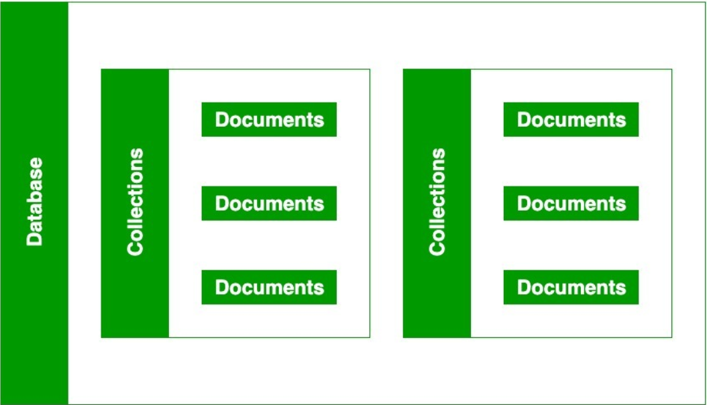

# Database, Collections, Documents

## Database

- **물리적 컨테이너**로서의 역할: 각 데이터베이스는 파일 시스템에서 별개의 파일 세트로 저장됩니다.
- **격리**: 서로 다른 데이터베이스는 서로 격리되어 있어, 데이터 보안과 구분이 용이합니다.
- **컬렉션 포함**: 하나 이상의 컬렉션을 포함하며, 데이터를 논리적으로 구분합니다.

## Collection

- **document의 그룹**: 컬렉션은 MongoDB 내의 문서들이 저장되는 곳으로, 관계형 데이터베이스의 테이블과 유사합니다.
- **schema 없음**: 컬렉션 내의 문서들은 서로 다른 필드를 가질 수 있어 유연한 데이터 모델링이 가능합니다.
- **데이터 관리**: 데이터베이스 내에서 데이터를 논리적으로 그룹핑하여 관리를 용이하게 합니다.

## Documents

- **데이터 저장 단위**: document는 데이터가 저장되는 기본 단위로, BSON(Binary JSON) 형태로 저장됩니다.
- **고유성**: 각 document는 고유한 ID(`_id` 필드)를 가집니다.
- **유연한 구조**: 다양한 데이터 타입의 필드를 포함할 수 있으며, 구조의 변화에 유연하게 대응할 수 있습니다.

## 암묵적 생성

- **사용자 편의성**: 문서를 저장할 때 해당 데이터베이스나 컬렉션이 존재하지 않으면, MongoDB는 이들을 자동으로 생성합니다.
- **유연한 개발**: 이 기능은 개발 과정에서 데이터 구조의 빠른 조정과 반응을 가능하게 합니다.
