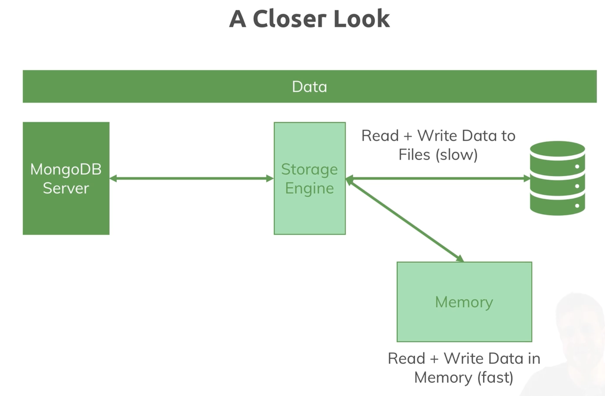

# Working with MongoDB

- mongoDB서버는 데이터를 파일에 직접 쓰지 않고 (커스텀한) 대체할 수 있는 저장소 엔진을 사용한다.
- wired tiger라는 기본 저장소 엔진은 훌륭한 저장소 엔진임
- mongodb는 기본적으로 driver나 shell로 부터 쿼리를 받아 삽입하길 원한다는 것을 알고 storage engine에 저장한다.
- storage engine은 그걸 파일에 저장함

## 서버의 데이터 계층(storage engine&file system)

- 파일을 읽는 것과 쓰는 것을 구분해야 함
- 쓰는 것은 좀 느리고, 메모리로 읽는건 빠름
- storage engine은 데이터를 로드하고 관리함
- 자주 사용하는 데이터가 메모리에 있을 수 있도록 데이터를 로드하고 관리함 => 그래서 빠름
- 데이터 베이스 파일에 저장하기도 함

## MongoDB 저장소 엔진의 역할

- 데이터 관리: MongoDB 서버는 데이터를 파일 시스템에 직접 쓰는 대신, 교체 가능한 저장소 엔진을 사용하여 데이터 관리를 수행합니다. 이 접근 방식은 데이터베이스 시스템의 유연성을 높이고, 성능과 데이터 관리 전략을 최적화하는 데 도움을 줍니다.

- `WiredTiger` 저장소 엔진: WiredTiger는 MongoDB의 기본 저장소 엔진으로, 고성능, 고확장성, 그리고 복잡한 데이터 관리 요구사항을 효율적으로 처리할 수 있는 설계로 널리 인정받고 있습니다. 이 엔진은 데이터 압축, 병렬 처리, 그리고 트랜잭션 관리 같은 고급 기능을 지원합니다.

참고문서
 <https://www.mongodb.com/ko-kr/docs/manual/core/wiredtiger>
